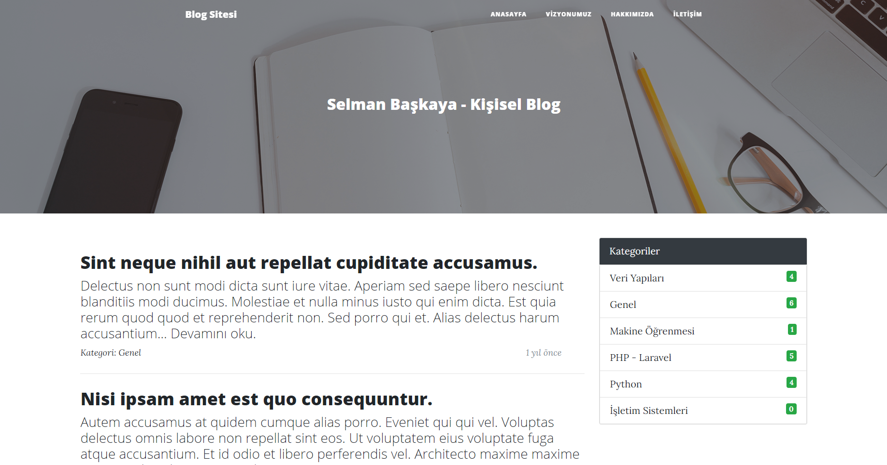
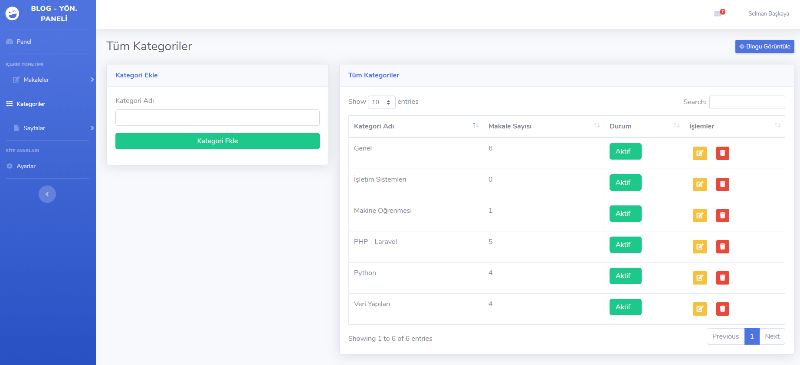
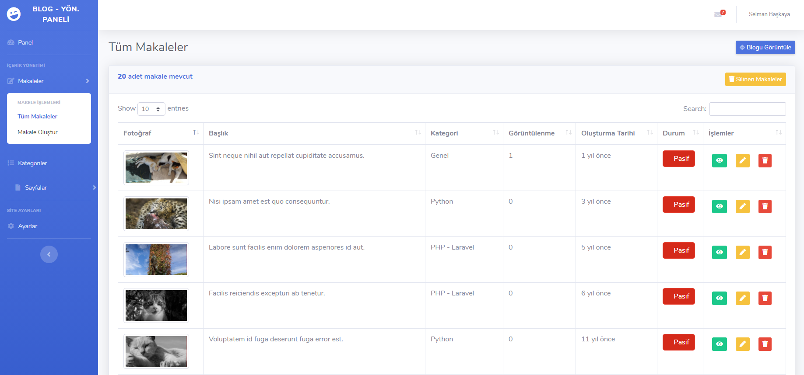

## Project

## Done

- [X] Index 
- [X] Dynamic Nav Links
- [X] Single Post
- [X] Backend Template
- [X] Adding&Listing Article
- [X] Toastr added
- [X] Updating&Deleting Article
- [X] Adding&Listing Category
- [X] Updating&Deleting Category
- [X] Adding&Listing Pages
- [X] Updating&Deleting Pages
- [X] Page Sorting with sortable.js
- [X] Added mailtrap.io
- [X] Website Dynamic Config Page

## License

The Laravel framework is open-sourced software licensed under the [MIT license](https://opensource.org/licenses/MIT).
